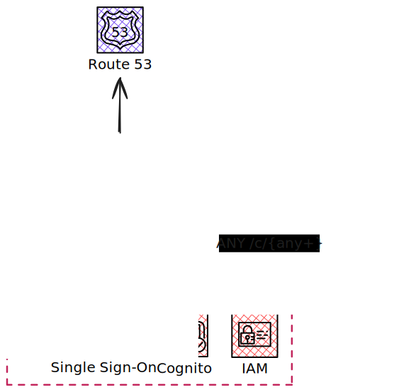

<p align="center">
  
  <h3 align="center">scud</h3>
  <p align="center"><strong>serverless Golang made simple, secure, and fast</strong></p>

  <p align="center">
    <!-- Version -->
    <a href="https://github.com/fogfish/scud/releases">
      
    </a>
    <!-- Documentation -->
    <a href="https://pkg.go.dev/github.com/fogfish/scud">
      
    </a>
    <!-- Build Status  -->
    <a href="https://github.com/fogfish/scud/actions/">
      
    </a>
    <!-- GitHub -->
    <a href="http://github.com/fogfish/scud">
      
    </a>
    <!-- Coverage -->
    <a href="https://coveralls.io/github/fogfish/scud?branch=main">
      
    </a>
    <!-- Go Card -->
    <a href="https://goreportcard.com/report/github.com/fogfish/scud">
      
    </a>
  </p>
</p>

--- 

`scud` (Serverless Configuration & Utilities for Deployment) is a developer-friendly toolkit for building and deploying secure serverless Golang APIs on AWS.

It simplifies the process of compiling Golang serverless functions as an integral part of the AWS CDK workflow. The resulting Lambda functions are directly consumable by both standard and third-party AWS CDK constructs.

SCUD also provides an AWS CDK L3 construct for API Gateway that takes care of the infrastructure boilerplate required for secure serverless RESTful API development.

With SCUD, you can deliver fast, secure, and maintainable serverless APIs without the boilerplate.

- [Getting started](#getting-started)
- [Quick Start](#quick-start)
- [Golang Serverless](#golang-serverless)
  - [Linker Flags and Version Injection](#linker-flags-and-version-injection)
  - [Lambda Environment Variables](#lambda-environment-variables)
  - [Architecture: Graviton vs x86\_64](#architecture-graviton-vs-x86_64)
  - [Container images](#container-images)
  - [Universal Function](#universal-function)
  - [Custom Go Environment](#custom-go-environment)
  - [Compressing binaries](#compressing-binaries)
- [API Gateway](#api-gateway)
  - [Quick Start](#quick-start-1)
  - [API Gateway](#api-gateway-1)
  - [API Gateway (Domain Name)](#api-gateway-domain-name)
  - [API Gateway (Resources)](#api-gateway-resources)
  - [Authorizer IAM](#authorizer-iam)
  - [Authorizer AWS Cognito](#authorizer-aws-cognito)
  - [Authorizer JWT](#authorizer-jwt)
- [HowTo Contribute](#howto-contribute)
- [License](#license)
- [References](#references)


## Getting started

The latest version of the library is available at its `main` branch. All development, including new features and bug fixes, take place on the `main` branch using forking and pull requests as described in contribution guidelines. The stable version is available via Golang modules.

Use `go get` to retrieve the library and add it as dependency to your application.

```bash
go get -u github.com/fogfish/scud
```

## Quick Start

Below is a minimal example of deploying a Golang application to AWS Lambda. The key feature here is that the compilation, packaging, and deployment of the function are fully integrated into the `cdk deploy` workflow.

```go
package main

import (
  "github.com/aws/aws-cdk-go/awscdk/v2"
  "github.com/aws/jsii-runtime-go"
  "github.com/fogfish/scud"
)

func main() {
  app := awscdk.NewApp(nil)
  stack := awscdk.NewStack(app, jsii.String("example"), nil)

  scud.NewFunctionGo(stack, jsii.String("MyFun"),
    &scud.FunctionGoProps{
      SourceCodeModule: "github.com/fogfish/scud",
      SourceCodeLambda: "examples/01_simple_function/lambda",
    },
  )

  app.Synth(nil)
}
```

## Golang Serverless

AWS CDK has a bundling feature that simplify the process of creating assets for Lambda functions from source code. This feature is useful for compiling and packaging Golang executable binaries into AWS Lambda assets. `scud` implements L3 construct to bundle Golang source code into ARM64 lambdas for Amazon Linux 2 requiring no effort that running `cdk deploy`.

```go
scud.NewFunctionGo(stack, jsii.String("Handler"),
  &scud.FunctionGoProps{
    // Golang module that containing the function
    SourceCodeModule: "github.com/fogfish/scud",
    // Path to lambda function within the module 
    SourceCodeLambda:  "test/lambda/go",
    // Lambda properties
    FunctionProps: &awslambda.FunctionProps{},
  },
)
```

The benefit of using this L3 construct is its **optimized deployment strategy**, designed for monorepos that contain many Lambda functions. It automatically detects changes in the source code and deploys **only the Lambda functions that have been modified**, instead of redeploying everything. This makes deployments faster and more efficient, especially in large projects.


### Linker Flags and Version Injection

You can inject custom variables and version information into your Go Lambda binary using the `GoVar` and `SourceCodeVersion` properties. These are passed as `-ldflags` to the Go compiler.

```go
scud.NewFunctionGo(stack, jsii.String("Handler"),
  &scud.FunctionGoProps{
    SourceCodeModule: "github.com/fogfish/scud",
    SourceCodeLambda: "test/lambda/go",
    SourceCodeVersion: "v1.2.3", // Injects -X main.version=v1.2.3
    GoVar: map[string]string{
      "main.buildTime": "2024-01-01",  // Injects -X main.buildTime=2024-01-01
      "main.commit":    "abc123",      // Injects -X main.commit=abc123
    },
  },
)
```

This allows you to access version and build information in your Lambda function:

```go
package main

var (
    version   = "dev"
    buildTime = "unknown" 
    commit    = "unknown"
)

func main() {
    log.Printf("Version: %s, Build: %s, Commit: %s", version, buildTime, commit)
    // ... rest of your Lambda code
}
```

### Lambda Environment Variables

Use `awslambda.Function` and its `AddEnvironment` method to set runtime environment variables for your Lambda function:

```go
f := scud.NewFunctionGo(stack, jsii.String("Handler"),
  &scud.FunctionGoProps{
    SourceCodeModule: "github.com/fogfish/scud",
    SourceCodeLambda: "test/lambda/go",
  }
)

// Set environment variables for the Lambda function
f.AddEnvironment(jsii.String("DATABASE_URL"), jsii.String("postgresql://..."), nil)
f.AddEnvironment(jsii.String("LOG_LEVEL"), jsii.String("debug"), nil)
```


### Architecture: Graviton vs x86_64

Graviton (ARM64) is default architecture for lambda function supported by the library. Use standard Golang environment variable `"GOARCH"` to change the default architecture. Pass environment variable using `GoEnv` property:

```go
scud.NewFunctionGo(scope, jsii.String("test"),
  &scud.FunctionGoProps{
    SourceCodeModule: "github.com/fogfish/scud",
    SourceCodeLambda:  "test/lambda/go",
    GoEnv: map[string]string{"GOARCH": "amd64"},
  },
)
```


### Container images

By default, Lambda functions are distributed as ZIP files. The library also supports building and deploying Lambda functions from containers. The provided L3 construct reduces the boilerplate required to define and build such containers, offering a simpler interface compared to the standard AWS CDK `DockerImageCode.fromImageAsset`. It allows you to easily package your executable, include static assets, and install any required packages.

The resulting container is based on either scratch if your code is pure Golang, or Linux Alpine if additional system packages are specified.

```go
scud.NewContainerGo(stack, jsii.String("test"),
  &scud.ContainerGoProps{
    SourceCodeModule: "github.com/fogfish/scud",
    SourceCodeLambda: "test/lambda/go",
    StaticAssets: []string{
      // list of files to be include into container
      // path is relative to SourceCodeModule
      // For example 
      "test/lambda/go/main.go"
    },
    Packages: []string{
      // Additional Linux packages to install
      "zip", "curl",
    },
  },
)
```

### Universal Function

For dynamic function creation, you can use the universal `NewFunction` constructor that accepts either `FunctionGoProps` or `ContainerGoProps`:

```go
// Works with FunctionGoProps
func1 := scud.NewFunction(stack, jsii.String("func1"),
  &scud.FunctionGoProps{
    SourceCodeModule: "github.com/fogfish/scud",
    SourceCodeLambda: "test/lambda/go",
  },
)

// Works with ContainerGoProps  
func2 := scud.NewFunction(stack, jsii.String("func2"),
  &scud.ContainerGoProps{
    SourceCodeModule: "github.com/fogfish/scud",
    SourceCodeLambda: "test/lambda/go",
  },
)
```

### Custom Go Environment

You can set additional Go environment variables for the build process using the `GoEnv` property. The library sets sensible defaults, but you can override them:

```go
scud.NewFunctionGo(stack, jsii.String("Handler"),
  &scud.FunctionGoProps{
    SourceCodeModule: "github.com/fogfish/scud",
    SourceCodeLambda: "test/lambda/go",
    GoEnv: map[string]string{
      "GOARCH":      "amd64",           // Override architecture
      "CGO_ENABLED": "1",               // Enable CGO if needed
      "GOCACHE":     "/tmp/go-build",   // Custom build cache
    },
  },
)
```

Default environment variables set by the library:
- `GOOS=linux`
- `GOARCH=arm64` 
- `CGO_ENABLED=0`


### Compressing binaries

The L3 constuct uses the `-s` and `-w` linker flags by default to strip the debugging information from binaries. If you have [UPX](https://upx.github.io/) installed, you can enable binary compression by setting the `SCUD_COMPRESS_UPX=1` environment variable before deploying the application. This can significantly reduce the size (almost 7x smaller) of your Lambda deployment package:

```bash
export SCUD_COMPRESS_UPX=1
cdk synth
```

The compression uses UPX with the `--best --lzma` flags for maximum compression.
See more about compressions:
* https://words.filippo.io/shrink-your-go-binaries-with-this-one-weird-trick/
* https://sibprogrammer.medium.com/go-binary-optimization-tricks-648673cc64ac


## API Gateway

AWS API Gateway and AWS Lambda are a perfect approach for quick prototyping or production development of microservices on Amazon Web Services. Unfortunately, it requires a significant amount of boilerplate AWS CDK code to bootstrap the development. The `scud` library implements high-order components on top of AWS CDK that harden the API pattern including built-in validation of OAuth2 Bearer tokens for each API endpoint, supporting various identity providers such as IAM, JWT tokens, and AWS Cognito.



### Quick Start

```go
package main

import (
  "github.com/aws/aws-cdk-go/awscdk/v2"
  "github.com/aws/aws-cdk-go/awscdk/v2/awsapigatewayv2"
  "github.com/aws/jsii-runtime-go"
  "github.com/fogfish/scud"
)

func main() {
  app := awscdk.NewApp(nil)
  stack := awscdk.NewStack(app, jsii.String("example-api"), nil)

  // API Gateway
  api := scud.NewGateway(stack, jsii.String("Gateway"), &scud.GatewayProps{})

  // Handler Function
  fun := scud.NewFunctionGo(stack, jsii.String("Handler"),
    &scud.FunctionGoProps{
      SourceCodeModule: "github.com/fogfish/scud",
      SourceCodeLambda:  "test/lambda/go",
    },
  )

  // Example endpoint
  api.AddResource("/example", fun)

  app.Synth(nil)
}
```

### API Gateway 

The library defined presets for AWS API Gateway V2. 

```go
scud.NewGateway(stack, jsii.String("Gateway"),
  &scud.GatewayProps{}
)
```

### API Gateway (Domain Name)

The library deploy gateway using default AWS host naming convention `https://{uid}.execute-api.{region}.amazonaws.com`. Supply custom domain name and Certificate ARN for custom naming.

```go
scud.NewGateway(stack, jsii.String("Gateway"),
  &scud.GatewayProps{
    Host: jsii.String("test.example.com"),
    TlsArn: jsii.String("arn:aws:acm:eu-west-1:000000000000:certificate/00000000-0000-0000-0000-000000000000"),
  },
)
```

### API Gateway (Resources)

The Gateway construct implements the `AddResource` function to associate a Lambda function with a REST API path. It uses the specified path as a prefix, enabling the association of the Lambda function with all subpaths under that prefix. 

```go
gateway.AddResource("/example", handler)
```

### Authorizer IAM

The library supports integration with AWS IAM to authorize incoming requests. This integration ensures that only authenticated and authorized principals  can access the resources and functionalities provided by your Lambda functions. By leveraging AWS IAM policies and roles, the library enforces fine-grained access control, enhancing the security of your API endpoints.

```go
api := scud.NewGateway(stack, jsii.String("Gateway"),
  &scud.GatewayProps{}
)

// Using the IAM authorizer requires specifying a principal or role. 
role := awsiam.NewRole(/* ... */)

api.NewAuthorizerIAM().
  AddResource("/example", handler, role)
```

You can still access API with curl even with IAM authorizer is used.

```bash
curl https://example.com/petshop/pets \
  -XGET \
  -H "Accept: application/json" \
  -H "x-amz-security-token: $AWS_SESSION_TOKEN" \
  --aws-sigv4 "aws:amz:eu-west-1:execute-api" \
  --user "$AWS_ACCESS_KEY_ID:$AWS_SECRET_ACCESS_KEY"
```

### Authorizer AWS Cognito

The library supports integration with AWS Cognito to authorize incoming requests. This integration allows you to manage user authentication and authorization seamlessly. By utilizing AWS Cognito, you can implement robust user sign-up, sign-in, and access control mechanisms. The library ensures that only authenticated users with valid tokens can access your API endpoints, providing an additional layer of security and user management capabilities. The integration of AWS API Gateway and AWS Cognito is well documented in [the official documentation](https://docs.aws.amazon.com/apigateway/latest/developerguide/apigateway-integrate-with-cognito.html). This pattern facilitates the deployment of this configuration by simply providing the ARN of the user pool and specifying scopes to protect your endpoints.

```go
api := scud.NewGateway(stack, jsii.String("Gateway"),
  &scud.GatewayProps{}
)

// Cognito pool has to be pre-defined.
// Supply list of allowed clients to control the access.
api.NewAuthorizerCognito("arn:aws:cognito-idp:...", /* ... */).
  AddResource("/example", handler, "my/scope")
```

### Authorizer JWT

The library supports integration with Single Sign On provider (e.g. Auth0) to authorize incoming requests using JWT tokens. This integration allows you to leverage external identity providers for user authentication, ensuring secure and seamless access to your API endpoints. By validating JWT tokens issued by the SSO provider, the library ensures that only authenticated users can access your resources. Additionally, this setup can support various SSO standards and providers, enhancing flexibility and security in managing user identities and permissions.

```go
api := scud.NewGateway(stack, jsii.String("Gateway"),
  &scud.GatewayProps{}
)

api.NewAuthorizerJwt("https://{tenant}.eu.auth0.com/", "https://example.com").
  AddResource("/example", handler, "my/scope")
```

## HowTo Contribute

The project is [MIT](https://github.com/fogfish/scud/blob/master/LICENSE) licensed and accepts contributions via GitHub pull requests:

1. Fork it and clone 
2. Create your feature branch (`git checkout -b my-new-feature`)
3. Commit your changes (`git commit -am 'Added some feature'`)
4. Push to the branch (`git push origin my-new-feature`)
5. Create new Pull Request

```bash
git clone https://github.com/fogfish/scud
cd scud

go build
go test
```

## License

[](LICENSE)

## References

1. [Migrating AWS Lambda functions from the Go1.x runtime to the custom runtime on Amazon Linux 2](https://aws.amazon.com/blogs/compute/migrating-aws-lambda-functions-from-the-go1-x-runtime-to-the-custom-runtime-on-amazon-linux-2/)
