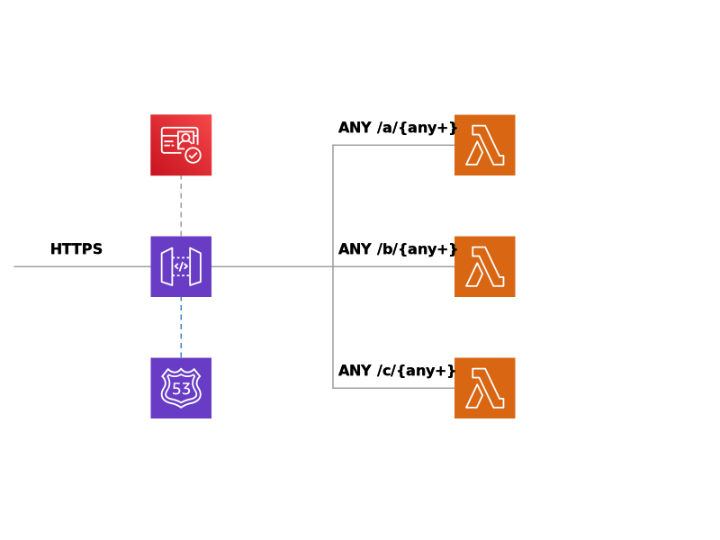

# scud

`scud` is a Simple Cloud Usable Daemon for serverless RESTful API development. 
This library is AWS CDK pattern that takes care about infrastructure boilerplate so that you focuses on development of application logic. 

[](https://github.com/fogfish/scud/tags)
[](https://github.com/fogfish/scud/actions/)
[](https://github.com/fogfish/scud)
[](https://coveralls.io/github/fogfish/scud?branch=main)


## Inspiration

AWS API Gateway and AWS Lambda is a perfect approach for quick prototyping or production development of microservice on Amazon Web Services. Unfortunately, it requires a boilerplate AWS CDK code to bootstrap the development. This library implements a high-order components on top of AWS CDK that hardens the api pattern



The library helps with building of lambda functions by
* integrating "compilation" fo Golang serverless functions within cdk workflows.
* integrates validation of OAuth2 Bearer token for each API endpoint


## Getting started

The latest version of the library is available at its `main` branch. All development, including new features and bug fixes, take place on the `main` branch using forking and pull requests as described in contribution guidelines. The stable version is available via Golang modules.

1. Use `go get` to retrieve the library and add it as dependency to your application.

```bash
go get -u github.com/fogfish/scud
```

2. Import it in your code

```go
import "github.com/fogfish/scud"
```

### Example RESTful API 

```go
import (
  "github.com/aws/aws-cdk-go/awscdk/v2"
  "github.com/aws/constructs-go/constructs/v10"
  "github.com/aws/jsii-runtime-go"
  "github.com/fogfish/scud"
)

func NewService(scope constructs.Construct) {
  // 1. declare lambda function
  myfun := scud.NewFunctionGo(scope, jsii.String("test"),
    &scud.FunctionGoProps{
      SourceCodePackage: "github.com/mygithub/myservice",
      SourceCodeLambda:  "aws/lambda/example",
      /* FunctionProps: optionally other awslambda.FunctionProps */
    },
  )

  // 2. declare api gateway
  gateway := scud.NewGateway(stack, jsii.String("Gateway"))

  // 3. assembles RESTful api service from gateway and lambda functions
  gateway.AddResource("hello", myfun)
  gateway.AddResource("world/europe", myfun)
  gateway.AddResource("world/asia", myfun)
}

// 4. injects the service to stack
stack := awscdk.NewStack(/* ... */)
NewService(stack)
```

Please see the RESTful API templates, clone them to draft a new microservice in matter of minutes:
* [blueprint-serverless-golang](https://github.com/fogfish/blueprint-serverless-golang)


### Example ARM64 functions

```go
myfun := scud.NewFunctionGo(scope, jsii.String("test"),
    &scud.FunctionGoProps{
      SourceCodePackage: "github.com/mygithub/myservice",
      SourceCodeLambda:  "aws/lambda/example",
      GoEnv: map[string]string{"GOARCH": "arm64"},
    },
  )
```

### Example RESTful API with Domain Name

Supply custom domain name and ARN of Certificate

```go
scud.NewGateway(stack, jsii.String("Gateway")).
  ConfigRoute53("test.example.com", "arn:aws:acm:eu-west-1:000000000000:certificate/00000000-0000-0000-0000-000000000000")
```


### Example protect RESTful API with OAuth2

The construct supports integration with AWS Cognito, the integration of AWS API Gateway and AWS Cognito is well depicted by [official documentation](https://docs.aws.amazon.com/apigateway/latest/developerguide/apigateway-integrate-with-cognito.html). The pattern enables deployment of this configuration, just supply ARN of user pool and supply scopes to protect endpoints 

```go
scud.NewGateway(stack, jsii.String("Gateway")).
  ConfigAuthorizer("arn:aws:cognito-idp:...").
	AddResource("hello", myfun, "my/scope")
```

## HowTo Contribute

The project is [MIT](https://github.com/fogfish/scud/blob/master/LICENSE) licensed and accepts contributions via GitHub pull requests:

1. Fork it and clone 
2. Create your feature branch (`git checkout -b my-new-feature`)
3. Commit your changes (`git commit -am 'Added some feature'`)
4. Push to the branch (`git push origin my-new-feature`)
5. Create new Pull Request

```bash
git clone https://github.com/fogfish/scud
cd scud

go build
go test
```

## License

[](LICENSE)
