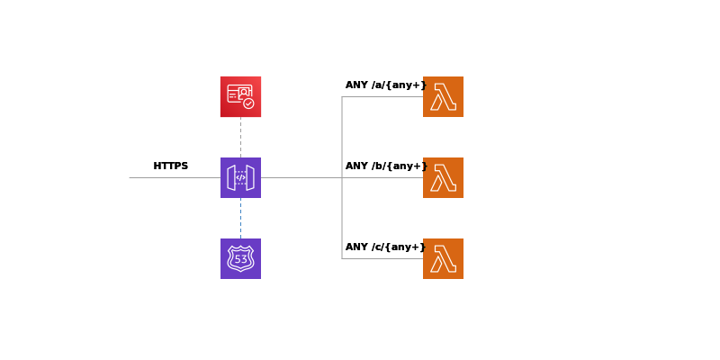

# scud

`scud` is a Simple Cloud Usable Daemon for serverless RESTful API development. 
This library is AWS CDK pattern that takes care about infrastructure boilerplate so that you focuses on development of application logic. 

[](https://github.com/fogfish/scud/actions/)
[](https://github.com/fogfish/scud)
[](https://coveralls.io/github/fogfish/scud?branch=master)
[](https://www.npmjs.com/package/aws-scud)


## Inspiration

AWS API Gateway and AWS Lambda is a perfect approach for quick prototyping or production development of microservice on Amazon Web Services. Unfortunately, it requires a boilerplate AWS CDK code to bootstrap the development. This library implements a high-order components on top of AWS CDK that hardens the api pattern



The library helps with
* building of lambda functions by integrating "compilation" process within cdk workflows. The following languages are supported:
- [x] Golang
- [ ] TypeScript

* integrates validation of OAuth2 Bearer token for each API endpoint


## Getting started

The latest version of the library is available at its `main` branch. All development, including new features and bug fixes, take place on the `main` branch using forking and pull requests as described in contribution guidelines.

```
npm install --save aws-scud
```

### Example RESTfull API 

```ts
import * as api from '@aws-cdk/aws-apigateway'
import * as lambda from '@aws-cdk/aws-lambda'
import * as scud from 'scud'
import * as pure from 'aws-cdk-pure'

// 1. declare lambda function
const MyFun = (): lambda.FunctionProps =>
  scud.handler.Go({
    code: path.join(__dirname, './myfun'),
    /* optionally other lambda.FunctionProps */
  })

// 2. declare api gateway
const Gateway = (): api.RestApiProps =>
  scud.Gateway({
    restApiName: 'example',
    /* optionally other api.RestApiProps */
  })

// 3. assembles RESTful api service from gateway and lambda functions
const service = scud.mkService(Gateway)
  .addResource('hello', scud.aws.Lambda(MyFun))

// 4. injects the service to stack
const stack = new cdk.Stack(/* ... */)
pure.join(stack, service)
```

Please see the RESTful API templates, clone them to draft a new microservice in matter of minutes:
* [scud-golang](https://github.com/fogfish/scud-golang)


## HowTo Contribute

The project is [MIT](https://github.com/fogfish/scud/blob/master/LICENSE) licensed and accepts contributions via GitHub pull requests:

1. Fork it and clone 
2. Create your feature branch (`git checkout -b my-new-feature`)
3. Commit your changes (`git commit -am 'Added some feature'`)
4. Push to the branch (`git push origin my-new-feature`)
5. Create new Pull Request

```bash
git clone https://github.com/fogfish/scud
cd scud

npm install
npm run build
npm run test
npm run lint
```

## License

[](LICENSE)
